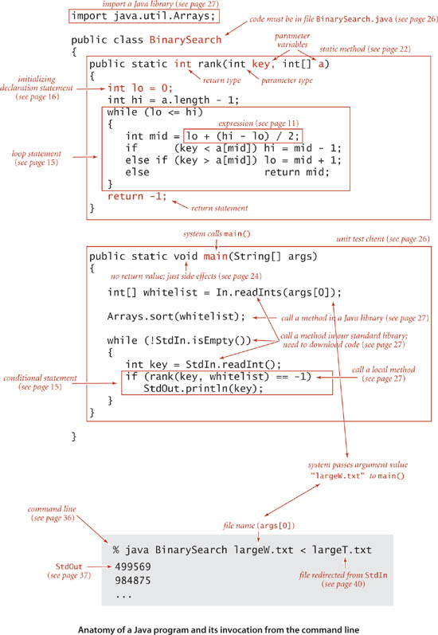
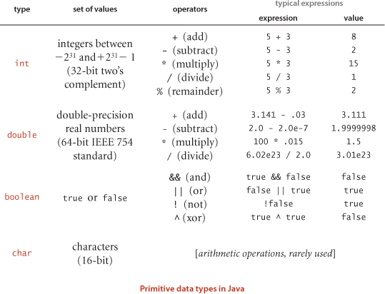
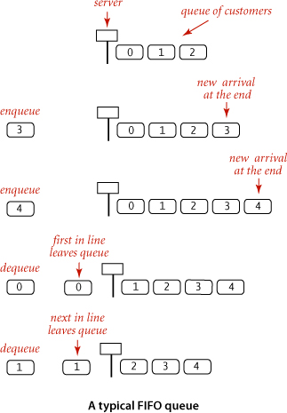

# Chapter 1

### Introduction

- algorithms: methods for solving problems that are suited for computer implementation
- data structures: schemes for organizing data that leave them amenable to efficient processing by algos
- all programs will be implemented in java

### Algorithms

- when writing programs, we are often implementing specific methods to complete tasks/solve problems. It is this method,
rather than the program itself, that specifies the steps we take to solve a problem
- algorithm is used in compsci to describe a finite, deterministic, and effective problem-solving method suitable for
implementation as a computer program
- you define an algorithm by describing a procedure for solving a problem in a natural language, or by writing a program
that implements the procedure
- most algorithms involve first organizing the data involved, this results in data structures.

## 1.1 Basic Programming Model

- programming model: the programming constructs, software libraries, and OS features used to implement and describe algos
  - The following pic details many of the basic features of the programming model:
  

      #### Basic Structure of a Java Program

      - a java program (class) is either a library of static methods, or a data type definition. 7 components:
    
          1. primitive data types: precisely definte the meaning of terms like integer, real number, and boolean.
          2. statements: allow us to define a computation by creating and assigning values to variables
          3. arrays: allow us to work with multiple values of the same type
          4. static methods: allow us to encapsulate and reuse code and to develop programs as individual models
          5. strings: sequences of characters
          6. input/output: sets up communication between programs and the outside world
          7. data abstraction: extends encapsulation and reuse to allow us to define non-primitive data types, thus supporting
          object-oriented programming.
      - To invoke a java program, we first compile it with `javac` then run it using the `java` command. 
      ### Primitive Data types and Expressions

      - 4 types: int, double, boolean, and char
      - each variable in java is associated with a datatype and stores a permissible data type
      - expressions are used to apply the operations associated with each data type
  

      ### Expressions
    
      - typical expressions are infix: a literal, followed by an operator, followed by another literal
      - expressions follow PEMDAS

      ### Type Conversion

      - numbers are automatically promoted to a more inclusive type if no information is lost.
      - In the expression `1 + 2.5`, the number 1 is promoted to a double value `1.0`
      - a cast is a type name in parentheses within an expression, or a directive to convert the following value into
      a value of that type. Example: `(int) 3.3` is `3` and `(double) 3` is `3.0`. Casting to `int` is truncating
      rather than rounding down or up, it just chops the end off.
  
      ### Declarations

      - java is strongly typed, meaning it checks for consistency
      - the scope of a variable is the part of the program where it is defined, and where it can be accessed
  
      ### Conditionals:

      - If statements are written like so:
  
          ~~~
          if (true) 
          {
              System.out.println("hello")
          }
          else 
          {
              System.out.println("no")
          }
          ~~~ 

      ### Break and continue:

      - `break` statement immediately exits whatever loop it is in
      - the `continue` statement begins the next iteration of the loop immediately

      ### Intialization within a loop

      - many loops intialize an index variable to create a counter for the loop:

          ```java
          public class Initializing {
              public static void main(String[] args) {
                  for (int count = 0; count <= 3; count++) {
                      System.out.println(count);
                  }
                  //This is similar to this:
                  int counter = 0;
                  while (counter <= 3) {
                      System.out.println(counter);
                      counter++;
                  }
              }
          }
          ```
      ### Arrays

      - an array stores a sequence of values that are all of the same type. The method we typically use to refer to 
      an individual array item is numbering and then indexing them. If we have N values, we think of them being numbered
      as 0 to N-1. They can be referenced with `a[N]`. 
      - Creating and initializing an array:
  
        - 3 steps: declare name and type, create the array, initialize array values
        - It can be seen with:
          ```java
          double[] a;
          a = new double[N]; // where N is the size of the array
          for (int i = 0; i < N; i++)
              a[i] = 0.0
          ```
        - once an array is declared, its size is fixed.
        - an array name refers to the whole array, if we assign one array name to another, then both refer to the same
          array. It is known as aliasing and can lead to subtle bugs. If you intend to make a copy of an array then you
          need to declare, create, and initialize a new array, then copy all of the entries in the original array to the 
          new array
          ```java
              int N = a.length;
              double[] b = new double[N];
              for (int i = 0; i< N; i++)
                  b[i] = a[i];
          ```
        
        ### Static Methods

        -  static methods are called *functions* in many programming languages. Each static method is a sequence
            of statements that are executed, one after another, when the static method is called. *Static* distinguishes
            these from instance methods.
        - Defining a static method:
          
          - a method encapsulates a computation that is defined as a sequence of statements. It takes arguments and 
          computes a return value of some data type or it causes a side effect that depends on the arguments.
          - Each static method is composed of a signature: the words `public static` followed by a return type,
          the method name, and a sequence of arguments, each with a declared type, and it is composed of a body:
          a statement block.
          - methods with the key word `void` are ones that have side effects, and return no values. They just return
          to the call after the last statement.

    ### Libraries

    - standard system libraries: `java.lang.*`
    - imported libraries like: `java.util.Arrays`, an import statement is needed for these.

    ### Input
  
    - java programs take input from the command line as an array of strings. You will need to use parseInt() or 
    parseDouble() to convert these inputs into ints or doubles if needed.
    - You can use `StdIn.*` to read input from the compilation in various types and ways \
    [StdIn Docs](https://introcs.cs.princeton.edu/java/stdlib/javadoc/StdIn.html)

    ### Formatted Output:

    - To format output use `System.out.printf("format statement", variable)`
    - Format portion begins with % and ends with a one-letter conversion code:

        - d for decimal
        - f for floating point values
        - s for String values

    ### Binary Search

    - takes an int key and a *sorted* array. It maintains two variables `lo` and `hi` and checks that the key is in the
    range `a[lo...hi]`. It will enter a loop that tests the middle entry of the array, if it is less than it will then
    test the mid of the left interval (same for greater than but right interval)
    - if the key is equal to the mid value, it will return mid. If it doesn't find that the key is in the array, it will
    return -1.

    ### Why do we embrace data abstraction?

    - It enables us to expand our ability to reuse code through modular programming
    - It provides a convenient mechanism for building so-called linked data structures
    - it enables us to precisely define the algorithmic challenges that we face.

## 1.2 Data Abstraction

- a data type is a set of values and a set of operations on those values
- the process of defining and using data types is known as *data abstraction*
- programming in java is largely based on building data types known as *reference types* with the Java Class.
- an abstract data type is a data type whose representation is hidden from the client. Implementing an ADT in Java
class is not very different from implementing a function library as a set of static methods.
- ADTs are implemented as a java Class, may provide a return value of a specified type or no return value, 
have constructors with no return type.

    ### Inherited Methods

    - various java conventions enable a custom data type to take advantage of built-in language mechanisms by
    including specific methods in the API. For example, all data types have a `.toString()` method that will
    represent the return value as a String representation.

    ### Objects

    - Object is an entity that can take on a data-type value. Objects are characterized by 3 essential properties:
    
        - state, identity, and behavior
    - The state of an object is a value from its data type
    - The identity of an object distinguishes on object from another. Useful to think about where it is stored in memory
    - The behavior of an object is the effect of data-type operations.
    - A *reference* is a mechanism for accessing an object. 

    ### Creating Objects

    - each specific data type value is stored in an object.
    - To create or instantiate an individual object, we invoke the data type constructor using the `new` keyword.
    followed by the class name, followed by a `()` or a list of arguments enclosed in the parentheses.
    - A constructor has no return types because all it does is create an object of the original data type in memory
    and references that memory location.
    - An example is: `Counter heads = new Counter("heads")`

    ### Invoking instance methods

    - so now we have our data type Counter and a object of it labeled `heads`... How do we use the methods available in 
    Counter?
    - We can invoke methods of the `Counter` data type by doing something like: `heads.increment()`

    ### Aliasing in objects

    - In objects, if you set one variable equal to another object, all it does is create a reference to that specific
    memory location. So if you make changes to one, it will make changes to both. Whereas when you set one primitive data
    type equal to another primitive data type, it actually makes a copy: if `x=1` and `y=2` and you set `x=y`, x will now
    be `x=2`

    ### Arrays are Objects

    - every value of a non-primitive type is an object. There is special language support 
    for certain operations on arrays such as: declarations, initialization, and indexing.

    ### Interface Inheritance

    - inheritance is the relationship between two objects
    - Subtyping is one inheritance mechanism, where the relationship is defined by an *interface*. In the interface
    you specify a set of common methods that each class must contain that inherits the base class. Example:
    ```java
    public interface Datable
    {
        int month();
        int day();
        int year();
    }
    
    // it is then inherited
    
    public class Date implements Datable
    {
        //implementation code here of the 3 methods
    }
    ```
  
    ### Implementation Inheritance

    - The next inheritance method is subclassing
    - Subclassing enables a developer to change behavior and add functionality without rewriting an entire class
    from scratch. You define a new class that inherits the methods and variables of another class. The subclass can
    redefine or override methods in the superclass. 

    ### String Conversion

    - By convention, every Java type inherits the `toString()` from Object, so any client can invoke `.toString()`
    - This is used to convert other primitive data types to strings, and is implicitly used anytime a string is 
    concatenated with another data type.

    ### Equality

    - Since variable names of objects are only references to their location in memory, you can't check the equality of
    two declared objects. This can be accomplished, however, with the `.equals()` method.

    ### Memory Management

    - Say you create two objects, `a` and `b`, if you then later set `a = b` you are setting them both to reference
    the memory location of `b`. This would leave the memory block created for the original `a` still in memory but
    not able to be referenced. This is known as orphaning an object. 
    - Memory management is much easier for primitive data types because all the information needed for memory
    allocation is known at runtime. 
    - For objects, it can be more difficult. However, Java has built-in memory management. Reclaiming this unused memory
    is known as garbage collection. 

## 1.3 Bags, Queues, and Stacks

- bags, queues, and stacks are fundament and broadly useful. 

    ### Generics

    - when declaring a class name you can include a type parameter like so: `Stack<Item>`
    - This is a symbolic placeholder for some concrete type to be used by the client. This can be read as a `Stack of Items`
    - This is used when you don't know the concrete type that will be used when initialized but the client can use any 
    type they want. 

    ### Iterables

    - Suppose a client is maintaining a collection of transactions like so:
  
    `Queue<Transaction> collection = new Queue<Transaction>();`

    - If the collection is iterable, the client could loop through and print each transaction in the queue:

        ```java
        for (Transaction t: collection)
            StdOut.println(t);
        ```
    - This would result in each transaction stored in the collection object to be printed out.
    - The construct used is a foreach statement

    ### Bags

    - a bag is a collection where removing items is not supported - its purpose is to provide the client with the 
    ability to collect items. 
    - The order of iteration is unspecified and the order of items in the bag is irrelevant. 
    - 

    ### FIFO Queue (or just Queue)

    - A first-in-first-out queue is a collection of items that works on the policy of doing tasks in the same order they
    arrive
    - When a client iterates through the items in a queue with the foreach construct, the items are processed in the 
    order they came in. A typical reason to use this is to save items in a collection while at the same time preserving
    their relative order. 
  
        

    ### Pushdown Stack (or just a stack)

    - a pushdown stack is a collection that is based on the last-in-first-out policy. 
    - When a client iterates through items in a stack, the items are processed in the reverse order of when they were
    added. A typical reason to use this is to save items in a collection while at the same time reversing their
    relative order. 

    ### Array Resizing

    - If an array is full, create a new array of *twice* the size, then copy all items over. This will keep from having
    to create a new array every time an input goes over the initial capacity. 
        ```java
        
        private void resize(int capacity)
        {
            String[] copy = new String[capacity];
            for (int i = 0; i < N; i++)
            {
                copy[i] = s[i];
            }
            s = copy;
        }
        
        ```
    - This takes time proportional to N
    - Time cost: ~3N
    - Shrinking an array:

        - wait until array gets 1/4 full then resize it to half-full
      
  ### When to use an array vs. linked list

    - If you need a guarantee that the operations will be quick and successful, use a linked list
    - If you want something that uses less memory/space and an average short time, use an array

    ### Calculating Memory Needs

      public class Fraction {
      long numerator, denominator;
      public Fraction add(Fraction f) {
      return new Fraction(....);
      }
      // . . . . . //
      }
    
        // Code:
        Fraction[] fList = new Fraction[10];
        for (int i=1; i<=10; i++)
            fList[i] = new Fraction(1,i);\

    - First, let us compute the size for a Fraction object (32):

            Object overhead: 16
            Instance variable: numerator, a long, needs 8 bytes
            Instance variable: denominator, a long, needs 8 bytes
            Total 32.
            No padding needed as it is multiple of 8.
            The code declares and initialize the following structures:
            
            Fraction[] flist - declares the variable fList, an array of Fraction, stored as an object, needs 8 bytes for its reference value
            new Fraction[10], an instance of an array of fractions, an object, overhead 24 (object, length, padding) and each element is a reference to a Fraction, 8 bytes for a reference, times 10 elements, 80, total 104
            the variable i in the for loop, 4
            the fractions that are referenced in the array, 10 fractions each with a size of 32,  total 320
            In total, the code needs 436 bytes. 

- Given the following memory requierements (in bytes):

    Declared variables of primitive types: boolean 1; byte 1; char 2; int 4; float 4; long 8; double 8
    
    Created Objects in memory (new): add the overhead (instance information - 16 bytes) to the memory needed for all 
    
    instance variables (non-static fields); pad to  a multiple of 8
    
    References of Objects (declared variables with an Object type): 8
- Compute the memory space needed for the following code fragment:
    ```java
        // Given:
        public class Fraction {
        long numerator, denominator;
        public Fraction add(Fraction f) {
        return new Fraction(....);
        }
        // . . . . . //
        }
    
        // Code:
        Fraction f1 = new Fraction(1,2);
        Fraction f2 = new Fraction(1,4);
    ```

    Assumes all the relevant information provided.

    Object overhead: 16

    Instance variable: numerator, a long, needs 8 bytes

    Instance variable: denominator, a long, needs 8 bytes

    Total 32.

    No padding needed as it is multiple of 8.

    The code declares and initialize the following variables:

    
The variable f1, a Fraction, needs 8 bytes for its reference value and 32 bytes for the object created with the 
constructor, total 40

The variable f2, a Fraction, needs 8 bytes for its reference value and 32 bytes for the object created with the 
constructor, total 40

**In total the code needs 80 bytes.** 

```java
// Given:
public final class Long extends Number implements Comparable<Long> {
    private final long value;
    // . . . . . //
}
public class Fraction {
    Long numerator, denominator;
    public Fraction add(Fraction f) {
        return new Fraction(....);
    }
    // . . . . . //
}

// Code: 
Fraction f = new Fraction(1,2);
```

Calculate the total bytes:
```text
First, let us compute the size for a Long object (32):

Object overhead: 16
Instance variable: value, a long, needs 8 bytes
Total 24.
No padding needed as it is multiple of 8.
Second, let us compute the size for a Fraction object (32):

Object overhead: 16
Instance variable: numerator, a reference to a Long, needs 8 bytes
Instance variable: denominator, a reference to a Long, needs 8 bytes
Total 32.
No padding needed as it is multiple of 8.
The code declares and initialize the following variables and objects:

new Fraction(1,2) will create two Long values for 1 and 2
new Long(1), automatically created for the initialization of 1/2 fraction, an instance of a Long, needs 24
new Long(2), needs 24 (same explanation as above)
new Fraction(1,2), needs 32 (stores references to the two Long values)
f, a Fraction, needs 8 bytes for the reference to the value
In total, we will need 24+24+32+8 = 88 bytes.
```