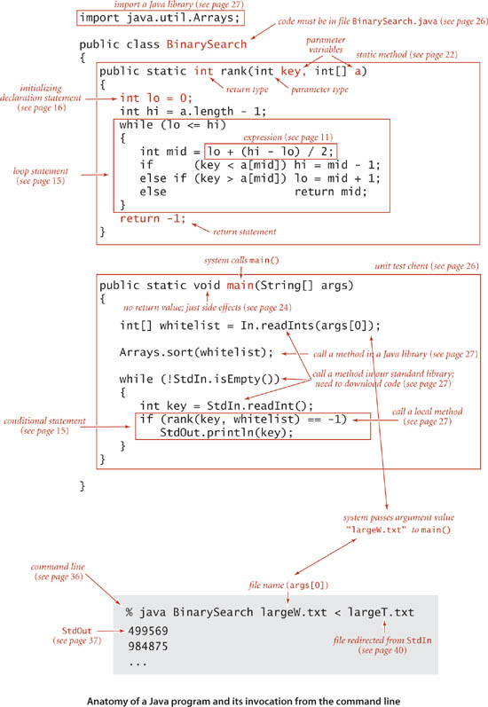
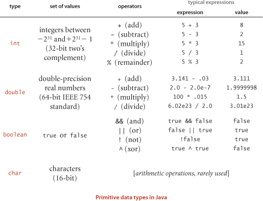

# Chapter 1

### Introduction

- algorithms: methods for solving problems that are suited for computer implementation
- data structures: schemes for organizing data that leave them amenable to efficient processing by algos
- all programs will be implemented in java

### Algorithms

- when writing programs, we are often implementing specific methods to complete tasks/solve problems. It is this method,
rather than the program itself, that specifies the steps we take to solve a problem
- algorithm is used in compsci to describe a finite, deterministic, and effective problem-solving method suitable for
implementation as a computer program
- you define an algorithm by describing a procedure for solving a problem in a natural language, or by writing a program
that implements the procedure
- most algorithms involve first organizing the data involved, this results in data structures.

## 1.1 Basic Programming Model

- programming model: the programming constructs, software libraries, and OS features used to implement and describe algos
  - The following pic details many of the basic features of the programming model:
  

      #### Basic Structure of a Java Program

      - a java program (class) is either a library of static methods, or a data type definition. 7 components:
    
          1. primitive data types: precisely definte the meaning of terms like integer, real number, and boolean.
          2. statements: allow us to define a computation by creating and assigning values to variables
          3. arrays: allow us to work with multiple values of the same type
          4. static methods: allow us to encapsulate and reuse code and to develop programs as individual models
          5. strings: sequences of characters
          6. input/output: sets up communication between programs and the outside world
          7. data abstraction: extends encapsulation and reuse to allow us to define non-primitive data types, thus supporting
          object-oriented programming.
      - To invoke a java program, we first compile it with `javac` then run it using the `java` command. 
      ### Primitive Data types and Expressions

      - 4 types: int, double, boolean, and char
      - each variable in java is associated with a datatype and stores a permissible data type
      - expressions are used to apply the operations associated with each data type
  

      ### Expressions
    
      - typical expressions are infix: a literal, followed by an operator, followed by another literal
      - expressions follow PEMDAS

      ### Type Conversion

      - numbers are automatically promoted to a more inclusive type if no information is lost.
      - In the expression `1 + 2.5`, the number 1 is promoted to a double value `1.0`
      - a cast is a type name in parentheses within an expression, or a directive to convert the following value into
      a value of that type. Example: `(int) 3.3` is `3` and `(double) 3` is `3.0`. Casting to `int` is truncating
      rather than rounding down or up, it just chops the end off.
  
      ### Declarations

      - java is strongly typed, meaning it checks for consistency
      - the scope of a variable is the part of the program where it is defined, and where it can be accessed
  
      ### Conditionals:

      - If statements are written like so:
  
      ~~~
      if (true) 
      {
          System.out.println("hello")
      }
      else 
      {
          System.out.println("no")
      }
      ~~~ 

      ### Break and continue:

      - `break` statement immediately exits whatever loop it is in
      - the `continue` statement begins the next iteration of the loop immediately

      ### Intialization within a loop

      - many loops intialize an index variable to create a counter for the loop:

      ```java
      public class Initializing {
          public static void main(String[] args) {
              for (int count = 0; count <= 3; count++) {
                  System.out.println(count);
              }
              //This is similar to this:
              int counter = 0;
              while (counter <= 3) {
                  System.out.println(counter);
                  counter++;
              }
          }
      }
      ```
      ### Arrays

      - an array stores a sequence of values that are all of the same type. The method we typically use to refer to 
      an individual array item is numbering and then indexing them. If we have N values, we think of them being numbered
      as 0 to N-1. They can be referenced with `a[N]`. 
      - Creating and initializing an array:
  
        - 3 steps: declare name and type, create the array, initialize array values
        - It can be seen with:
          ```java
          double[] a;
          a = new double[N]; // where N is the size of the array
          for (int i = 0; i < N; i++)
              a[i] = 0.0
          ```
        - once an array is declared, its size is fixed.
        - an array name refers to the whole array, if we assign one array name to another, then both refer to the same
          array. It is known as aliasing and can lead to subtle bugs. If you intend to make a copy of an array then you
          need to declare, create, and initialize a new array, then copy all of the entries in the original array to the 
          new array
          ```java
              int N = a.length;
              double[] b = new double[N];
              for (int i = 0; i< N; i++)
                  b[i] = a[i];
          ```
        
        ### Static Methods

        -  static methods are called *functions* in many programming languages. Each static method is a sequence
            of statements that are executed, one after another, when the static method is called. *Static* distinguishes
            these from instance methods.
        - Defining a static method:
          
          - a method encapsulates a computation that is defined as a sequence of statements. It takes arguments and 
          computes a return value of some data type or it causes a side effect that depends on the arguments.
          - Each static method is composed of a signature: the words `public static` followed by a return type,
          the method name, and a sequence of arguments, each with a declared type, and it is composed of a body:
          a statement block.
          - methods with the key word `void` are ones that have side effects, and return no values. They just return
          to the call after the last statement.

    ### Libraries

    - standard system libraries: `java.lang.*`
    - imported libraries like: `java.util.Arrays`, an import statement is needed for these.

    ### Input
  
    - java programs take input from the command line as an array of strings. You will need to use parseInt() or 
    parseDouble() to convert these inputs into ints or doubles if needed.
    - You can use `StdIn.*` to read input from the compilation in various types and ways \
    [StdIn Docs](https://introcs.cs.princeton.edu/java/stdlib/javadoc/StdIn.html)

    ### Formatted Output:

    - To format output use `System.out.printf("format statement", variable)`
    - Format portion begins with % and ends with a one-letter conversion code:

        - d for decimal
        - f for floating point values
        - s for String values

    
 