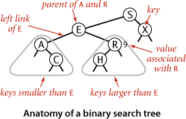
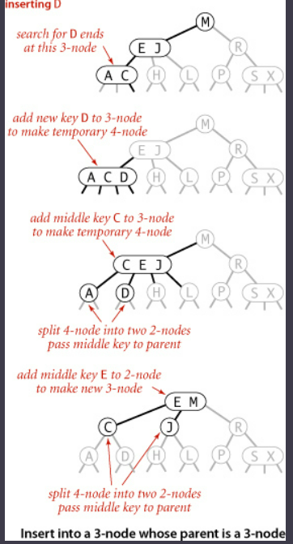

# Chapter 3: Searching

## 3.1 Symbol Tables

  - primary purpose of a symbol table is to associate a value with a key
  - client can insert key-value pairs into the symbol table with the expectation of later being able to search for the 
    value associated with a given key
  - To implement:

    - define the underyling data structure
    - specify the algorithms for insertion of new pairs, and searching existing pairs
    - specify operations that create and manipulate the data structure
  - Symbol table API consists of:

    - `public class ST<Key, Value>`: class definition
    - `ST()`: creates a new symbol table
    - `void put(Key key, Value val)`: put key-value pair into the table and remove key from table if value is `null`
    - `Value get(Key key)`: return the value paired with provided key
    - `void delete(Key key)`: remove key and its value from the table
    - `boolean isEmpty()`: is the table empty?
    - `boolean contains(Key key)`: is there a value paired with this key?
    - `int size()`: number of key-value pairs in the table
    - `Iterable<Key> keys()`: return all the keys in the table
  - we adopt the following assumptions:
    
    - only one value is associated with each key (no duplicate keys in a table)
    - when a client puts a key-value pair into a table already containing that key, the new value replaces the old
  - This defines the *associative array abstraction* 
  - Keys must no be null
  - Values should not be null
  - Deletion

    - deletion in symbol tables generally involves one of two strategies: lazy deletion, where we simply associate the 
      keys with null and eager deletion, where we remove the key from the table immediately
  - Iteration

    - to enable clients to process all keys and values in the table, we specify a `keys()` method that returns an
      `Iterable<Key>` object for clients to use to iterate through the keys.

### Ordered Symbol Tables

  - Several symbol-table implementations take advantage of order among the keys that is implied in Comparable objects
    to provide efficient implementations of the `put()` and `get()` methods. 
  - For applications where the keys are comparable this is our API:

    - `public class ST<Key extends Comparable<Key>, Value>` : class definition
    - `ST()`                                                : creates a new symbol table
    - `void put(Key key, Value val)`                        : put key-value pair into the table and remove key from 
                                                              table if value is `null`
    - `Value get(Key key)`                                  : return the value paired with provided key
    - `void delete(Key key)`                                : remove key and its value from the table
    - `boolean isEmpty()`                                   : is the table empty?
    - `boolean contains(Key key)`                           : is there a value paired with this key?
    - `int size()`                                          : number of key-value pairs in the table
    - `Key min()`                                           : smallest key
    - `Key max()`                                           : largest key
    - `Key floor(Key key)`                                  : largest key less than or equal to key
    - `Key ceiling(Key key)`                                : smallest key greater than or equal to key
    - `int rank(Key key)`                                   : number of keys less than key
    - `Key select(int k)`                                   : key of rank k
    - `void deleteMin()`                                    : delete smallest key
    - `void deleteMax()`                                    : delete largest key
    - `int size(Key lo, Key hi)`                            : number of keys in [lo...hi]
    - `Iterable<Key> keys(Key lo, Key hi)`                  : keys in [lo...hi] in sorted order
    - `Iterable<Key> keys()`                                : return all the keys in the table

### Cost Model

  - when studying symbol-tables we count compares (equality tests or key comparisons). This is referring to the operation
    of comparing a symbol-table entry against the search key.

### Sequential Search unordered

  - Basic frequency counter is a sequential search. This is when we search by considering the keys in a table one after
    another, using `equals()` to test for a match with our search key.
  - Average cost of sequential search is roughly N/2 or (N+1)/2 accesses
  - it is too slow for large amounts of data. Total number of compares is proportional to the product of the number of
    searches and the number of inserts. 

### Binary Search in an Ordered Array

  - this involves the ordered symbol table API above.
  - The heart of the implementation is the `rank()` method, which returns the number of keys smaller than a given key.
  - The rank tells us precisely where a key is found in the table, and whether it is in the table or not. 
  - For `put()`, the rank tells us exactly where to update the value when the key is in the table, and where to put the
    key when the key is not in the table.
  - carries the inconvenience of having to create a Key array of type Comparable and a Value array of type Object, and
    to cast them back to Key[] and Value[] in the constructor.

### Binary Search

  - maintain indices in the array that delimit the subarray that might contain the search key. To search, we compare
    the search key against the key in the middle of the subarray. If the search key is less than the key in the middle, 
    we search in the left half of the subarray. If it is greater than the middle key, we search in the right half.
    Otherwise, it is equal to the middle.

### Analysis of Binary Search

  - Binary search in an ordered array with N keys uses no more than lg N + 1 compares for a search (successful or unsuccessful).
  - Inserting a new key into an ordered array of size N uses ~ 2N array accesses in the worst case, so inserting N keys
  into an initially empty table uses ~ N2 array accesses in the worst case.

## 3.2 Binary Search Tree's

  - In a binary search tree, we have the restriction that every node is pointed to by just one other node, which is 
    called its parent, and that each node has two links, which are called its left and right links, that point to nodes
    called its left child and right child. Although its just pointing to a node, we can view each link as pointing to 
    another separate subtree
  - in a binary search tree, each node has a key and a value, with an ordering restriction to support efficient search
    - Formal definition: 

      - A binary search tree is a binary tree where each node has a Comparable key (and an associated value) and satisfies
        the restriction that the key in any node is larger than the keys in all the nodes in the parent nodes left subtree 
        and smaller than all the keys in the nodes right subtree.

        
  - Code representation:

    ```java
    public class BST<Key extends Comparable<Key>, Value>
    {
        private Node root;               // root of BST
        
        private class Node
        {
            private Key key;              // key
            private Value val;            // associated value
            private Node left, right;     // links to subtrees
            private int N;                // # nodes in subtree rooted here
        
            public Node(Key key, Value val, int N)
            {  this.key = key; this.val = val; this.N = N; }
        }
        
        public int size()
        {  return size(root);  }
        
        private int size(Node x)
        {
            if (x == null) return 0;
            else           return x.N;
        }
        
        public Value get(Key key);
        
        public void put(Key key, Value val);
    }
    ```

    - we define a private nested class within the BST class similar to our linked list implementation
    - Each node contains a key, value, left link, right link, and a node count. The left link points to a BST for
      items with smaller keys, and the right link points to a BST for items with larger keys.
    - the variable N gives the count of nodes in the current subtree where this is the root
    - the `size()` method thats private returns the size of a node and return 0 if its a null link.
  - Searching:

    - Given a search key, if the tree is empty we have a search miss, if the search key is equal to the key at the root
      we have a search hit, otherwise we search (recursively) in the appropriate subtree, moving right if the key
      is larger than the root value and moving left if the key is smaller.
  - Inserting:

    - if the tree is empty, we return a new node containing the key and value; if the search key is less than the key
      at the root, we set the left link to the result of inserting the key into the left subtree; otherwise, we set
      the right link to the result of inserting the key into the right subtree.
  - Recursion:

    - Think of operations as moving both up and down the tree. Before the recursive calls as happening on the way down
      the trees, and the code after the recursive call as happening on the way up the tree. For `get()` this is a series
      of return statements, and for `put()` this is resetting the link of each parent to its child on the search path
      and incrementing the counts on the way back up the path.
  - Analysis:

    - running times of algorithms on BSTs depend on the shape of the trees, which, in turn, depend on the order in which
      keys are inserted.
    - Best case: a tree with N nodes could be perfectly balanced with ~logN nodes between the root and each null link
    - Worst case: there could be N nodes on the search path
    - Analysis of this model stems from the observation that BSTs are dual to quicksort

        - the node at the root of the tree corresponds to the first partitioning item in quicksort (no keys to the left
          are larger and no keys to the right are smaller)
        - the subtrees are built recursively, corresponding to quicksort's recursive subarray sorts
    - Search hits in a BST built from N random keys require ~ 2 ln N (about 1.39 lg N) compares, on the average.
    -  Insertions and search misses in a BST built from N random keys require ~ 2 ln N (about 1.39 lg N) 
       compares, on the average.

### Implementing the API through our BST

  - Min and max:

    - if the left link of the root is null, the smallest key in a bst is the key at that root; if the left link is not
      null, the smallest key in the bst is the smallest key in the subtree rooted at the node referenced by the left link
    - Maximum works the same way just checking the right link
  - Floor and Ceiling

    - if a given key is less than the key at the root of the BST, then the floor is of Key must be in the left subtree
    - If a key is greater than the key at the root, then the floor of the key could be in the right subtree, but only
      if there is a key smaller than or equal to key in the right subtree; if not, then the key at the root is the floor
      of key

### Analysis of BST Operations

  - In a BST, all operations take time proportional to the height of the tree, in the worst case

## 3.3 Balanced Search Trees

  - previous algorithms work well in a variety of cases, but have poor worst-case performance.
  - Balanced search tree is a binary search tree that is guaranteed to be logarithmic no matter the sequence of keys 
    used to construct it

### 2-3 Search Tree

  - We need to allow nodes to hold more than one key. In a standard BST: the nodes are known as 2-nodes (2 links, one key)
  - We will now use 3-nodes: 3 links and two keys
  - A 2-3 Search Tree is a tree that is either empty or:

    - a 2-node, with one key (and associated value) and two links, a left link to a 2-3 search tree with smaller keys,
      and a right link to a 2-3 search tree with larger keys
    - a 3 node, with two keys (and associated values) and three links, a left/right link to smaller/larger 2-3 search 
      tree, and a mid link to a 2-3 search tree with keys in between the values of the two keys in the root node
  - A perfectly balanced 2-3 search tree is one whose null links are all the same distance from the root.

### Searching

  - to determine whether a key is in the tree, we compare it against the keys at the root. If it is equal to any,
    we have a search hit. Otherwise, we follow the link from the root to the subtree corresponding to the interval of
    key values that could contain the search key, if that link is null we have a search miss; otherwise we recursively
    search that tree

### Inserting into a 2-node

  - search for the key where the search terminates, and if it is a 2-node then we replace it with a 3-node containing
    the old key and the new key.

### Inserting into a 3-node consisting of a single 3-node

  - if the tree only has a single 3-node and you are inserting, you must temporarily put the key into a 4-node
    (three keys and 4 links). Then convert into a 2-3 tree made up of three 2-nodes, one with the middle key, one with
    the smallest key, and one with the largest key. The middle key is the parent node, and the smaller one is pointed 
    to by the left link of the middle key, while the right link points to the larger of the 3 original keys

### Inserting into a 3-node whose parent is a 3-node

  

  - again, make a temporary 3-node, then split it and insert the middle key into the parent. 
  - the parent was a 3-node so we replace it with a temporary 4-node containing the middle key from the 4-node split. 
    Then we split the new 4 node and insert its middle key into its parent. We continue up the tree, splitting 4-nodes
    and inserting their middle keys into their parents until reaching a 2-node, which we replace with a 3-node that 
    doesn't need to be split, or we reach a 3-node at the root.

### Splitting the Root

  - if we have 3-nodes along the whole path from the insertion point to the root, we end up with a temporary 4-node at
    the root. In this case we can process in precisely the same way as inserting into a tree consisting of a single 3-node
  - We split the temporary 4-node into 3 2-nodes, increasing the height of the tree by 1.

### Local Transformations
    
  - splitting a temporary 4-node in a 2-3 tree involves one of 6 transformations
  
      - it may be the root, the left child or the right child of a 2-node, or it may be the left, middle, or right child
        of a 3-node
  - all changes in a 2-3 tree are local. Meaning no part of the tree needs to be examined or modified other than the 
    specified nodes and links

### Final Notes on Balanced BST

  - search and insert operations in a 2-3 tree are guaranteed to visit at most logN nodes
  - total cost of any search or insert is guaranteed to be logarithmic

### Questions to know:

- Given the following sequence of letters create  a 2-3 balanced search tree by adding the nodes following the insertion 
  algorithm. For the letter provided (e.g. N3) indicate one of the following operations:

        transform empty root in 2 node N3
        transform 2 node N1 in 3 node  N1 N3
        transform 2 node N4 in 3 node  N3 N4
        transform 3 node N1 N2  in 4 node N1 N2 N3
        transform 3 node N1 N4  in 4 node N1 N3 N4
        transform 3 node N4 N5  in 4 node N3 N4 N5
        Sequence: B A L N C E D

- Where you will place the letter: C
  
        After inserting N we obtain the 2-3 tree:
        
        B
        / \
        A  L N
        When we add C we will add it to the node L N and obtain a temporary 4 node:
        
        B
        / \
        A  C L N
        Therefore the correct answer is: transform 3 node L N in 4 node C L N
- Given the following sequence of letters create  a 2-3 balanced search tree by adding the nodes following the insertion 
algorithm. For the letter provided (e.g. N3) indicate one of the following operations:

    `Sequence: B A L N C E D`

- When you placed the letter: L you obtained a 4  node:  A B L. To resolve this 4 node you created a new root 2-node B. 
What you will place as the right node of B? Answer using the template:

    `2 node N`
    `3 node N1 N2`

- When we add L we will add it to the root node and obtain a temporary 4 node:

    ```
     A B L
    / | | \
    To resolve it we  will create a new root 2 node: B. To  the right of B you  will place the 2 node L.
    ```

- Given the following sequence of letters create  a 2-3 balanced search tree by adding the nodes following the insertion
algorithm. For the letter provided (e.g. N3) indicate one of the following operations:

    
    transform empty root in 2 node N3
    transform 2 node N1 in 3 node  N1 N3
    transform 2 node N4 in 3 node  N3 N4
    transform 3 node N1 N2  in 4 node N1 N2 N3
    transform 3 node N1 N4  in 4 node N1 N3 N4
    transform 3 node N4 N5  in 4 node N3 N4 N5
    Sequence: B A L N C E D

- Where you will place the letter: N


    After inserting L we obtain the 2-3 tree:
    
    B
    / \
    A   L
    When we add N we will add it to the node L and obtain:
    
    B
    / \
    A  L N
    Therefore the correct answer is: transform 2 node L in 3 node L N

- Given the following sequence of letters create  a 2-3 balanced search tree by adding the nodes following the insertion 
algorithm. For the letter provided (e.g. N3) indicate one of the following operations:


    transform empty root in 2 node N3
    transform 2 node N1 in 3 node  N1 N3
    transform 2 node N4 in 3 node  N3 N4
    transform 3 node N1 N2  in 4 node N1 N2 N3
    transform 3 node N1 N4  in 4 node N1 N3 N4
    transform 3 node N4 N5  in 4 node N3 N4 N5
    Sequence: B A L N C E D

Where you will place the letter: B


    Starting with an empty root and adding B you will just  add  B to the root node, obtaining the 2 node B

- Given the following sequence of letters create  a 2-3 balanced search tree by adding the nodes following the insertion 
algorithm. For the letter provided (e.g. N3) indicate one of the following operations:


    transform empty root in 2 node N3
    transform 2 node N1 in 3 node  N1 N3
    transform 2 node N4 in 3 node  N3 N4
    transform 3 node N1 N2  in 4 node N1 N2 N3
    transform 3 node N1 N4  in 4 node N1 N3 N4
    transform 3 node N4 N5  in 4 node N3 N4 N5
    Sequence: B A L N C E D

- Where you will place the letter: L


    After inserting B and A we obtain the 2-3 tree:
    
    A B
    / | \
    When we add L we will add it to the root node and obtain a temporary 4 node:
    
    A B L
    / | | \
    Therefore the correct answer is: transform 3 node A B in 4 node A B L
    
    The keys must be  ordered in the nodes

- Given the following sequence of letters create  a 2-3 balanced search tree by adding the nodes following the insertion 
algorithm. For the letter provided (e.g. N3) indicate one of the following operations:


    transform empty root in 2 node N3
    transform 2 node N1 in 3 node  N1 N3
    transform 2 node N4 in 3 node  N3 N4
    transform 3 node N1 N2  in 4 node N1 N2 N3
    transform 3 node N1 N4  in 4 node N1 N3 N4
    transform 3 node N4 N5  in 4 node N3 N4 N5
    Sequence: B A L N C E D

- Where you will place the letter: A


    After inserting B we obtain the 2-3 tree:
    
    B
    / \
    When we add A we will add it to the root node and obtain:
    
    A B
    / | \
    Therefore the correct answer is: transform 2 node B in 3 node A B

Given the following sequence of letters create  a 2-3 balanced search tree by adding the nodes following the insertion 
algorithm. For the letter provided (e.g. N3) indicate one of the following operations:


    transform empty root in 2 node N3
    transform 2 node N1 in 3 node  N1 N3
    transform 2 node N4 in 3 node  N3 N4
    transform 3 node N1 N2  in 4 node N1 N2 N3
    transform 3 node N1 N4  in 4 node N1 N3 N4
    transform 3 node N4 N5  in 4 node N3 N4 N5
    Sequence: B A L N C E D

Where you will place the letter: C

Selected Answer:
transform 3 node N4 N5 in 4 node N3 N4 N5
Response Feedback:
After inserting N we obtain the 2-3 tree:

B
/ \
A  L N
When we add C we will add it to the node L N and obtain a temporary 4 node:

B
/ \
A  C L N
Therefore the correct answer is: transform 3 node L N in 4 node C L N