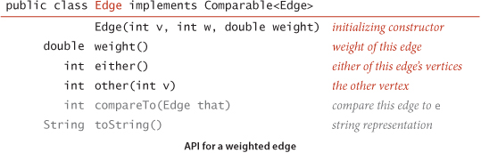
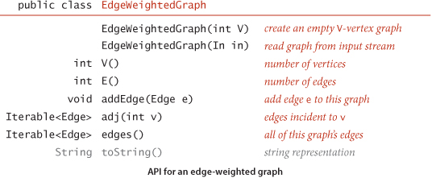

# Chapter 4: Graphs

  - Pairwise connections between items play critical roles in a vast array of computational applications.

    - Is there a way to connect one item to another by following connections?
    - How many items are connected to a given item?
    - What is the shortest chain of connections between this item and another?
  - Graphs are used to answer the questions posed above.  

## 4.1 Undirected Graphs

  - Start of our study. Graph models:

    - edges are nothing more than connections between vertices
  - undirected graphs are used when we need to distinguish this model from other models.
  - Undirected Graph: set of vertices and a collection of edges that connect a pair of vertices
  - By convention, we use the names 0 through V - 1 for the names of vertices in a V-vertex graph
  - we use `v-w` to refer to an edge that connects `v` to `w` 

### Anomalies in Undirected Graphs

  - our definition of a graph allows for two simple anomalies:

    - a self-loop is an edge that connects a vertx to itself
    - two edges that connect the same pair of vertices are parallel
  - graphs with parallel edges are sometimes referred to as *multigraphs* and graphs with no parallel edges
    or self loops are referred to as *simple graphs*
  - We can refer to every edge just by naming the two vertices it connects

### Glossary

  - When there is an edge connecting to vertices, we say that the vertices are adjacent to one another and that the 
    edge is incident to both vertices
  - The degree of a vertex is the number of edges incident to it.
  - A subgraph is a subset of a graphs edges and associated vertices that constitutes a graph.
  - A path in a graph is a sequence of vertices connected by edges.

    -  a simple path is one with no repeated vertices
    - a cycle is a path with at least one edge whose first and last vertices are the same
    - a simple cycle is a cycle with no repeated edges or vertices
    - the length of a path or cycle is its number of edges
  - we say that one vertex is connected to another if there exists a path that contains both of them. 
  - `u-v-w-x` is a path from `u` to `x`
  - `u-v-w-x-u` is a cycle from `u` to `u`
  - a graph is connected if there is a path from every vertex to every other vertex in the graph
  - a graph that is not connected consists of a set of connected components, which are maximal connected subgraphs
  - an acyclic graph is a graph with no cycles
  - a tree is an acyclic connected graph.

    - a disjoint set of trees is called a forest
    - a spanning tree of a connected graph is a subgraph that contains all of the graphs vertices and is a single tree.
    - a spanning forest of a graph is the union of spanning trees and of its connected components
  - A graph `G` with `V` vertices is a tree if and only if it satisfies any of the following five conditions:

    1. G has V-1 edges and no cycles
    2. G has V-1 edges and is connected
    3. G is connected, but removing any edge disconnects it
    4. G is acyclic, but adding any edge creates a cycle
  - density of a graph is the proportion of possible pairs of vertices that are connect by edges.

    - a sparse graph has relatively few of the possible edges present
    - a dense graph has relatively few of the possible edges missing
    - generally we think of a graph as being sparse if its number of different edges is within a small constant factor
      of V and as being dense otherwise
  - a bipartite graph is a graph whose vertices we can divide into two sets such that all edges connect a vertex in one
    set with a vertex in another set

### Undirected Graph Data Type

  

  - this API contains two constructors, methods to return the number of vertices and edges, a method to add to an edge, 
    a `toString()` method, and a method `adj()` that allows client code to iterate through the vertices adjacent to a 
    given vertex. 
  - the second constructor assumes an input format consisting of 2E+2 integer values: V, then E, then E pairs of values
    between 0 and V-1, each pair denoting an edge. 

### Representation Alternatives

  - two basic requirements:

    - we must have the space to accommodate the types of graphs that we are likely to encounter in applications
    - we want to develop time-efficient implementations of `Graph` instance methods - the basic methods that we need
      to develop graph-processing clients
  - 3 possible data structures for implementation:

    1. adjacency matrix: where we maintain a V-by-V boolean array,with the entry row v and column w defined to be `True`
       if there is an edge in the graph that connects vertex v and vertex w in the graph, and `false` otherwise. This
       representation fails on the first count - graphs with millions of vertices are common and the space cost for the 
       V^2 boolean values needed is prohibitive
    2. An Array of Edges: using an Edge class with two instance variables of type `int`.This is simple, but it fails on
       time-efficient count because to implement `adj` we would have to examine all the edges
    3. An Array of Adjacency Lists: we maintain a vertex-indexed array of lists of the vertices adjacent to each vertex.
       
        - so it is a vertex-index array. each index contains a list of vertices considered adjacent to the index vertex
  
### Adjacency-Lists Data Structure

  - standard graph representation for graphs that are not dense is called the adjacency-lists data structure,
    where we keep track of all the vertices adjacent to each vertex on a linked list that is associated with that vertex
  - We maintain an array of lists so that, given a vertex, we can immediately access its list. 
  - We implement these with a Bag ADT with a linked-list implementation, so that we can add new edges in constant
    time and iterate through adjacent vertices in constant time per adjacent vertex.
  - To add an edge connecting `v and w`, we add `w` to `v's` adjacency list and `v` to `w`'s adjacency list. Thus, each
    edge appears twice in the data structure.
  - This implementation achieves the following performance characteristics:

    - Space usage proportional to V + E
    - Constant time to add an edge
    - Time proportional to the degree of V to iterate through vertices adjacent to v

  
  
  
  
### Depth First Search

  - Searching In A Maze

    - searching through a graph can be compared to finding our way through a maze that has passages connected by
      intersections
    - maze = graph, intersection = vertex, passage = edge
    - Tremaux Exploration:

      - take any unmarked passage, unrolling a string behind you
      - mark all intersections and passages the first time you visit them
      - retrace steps (using the string) when approaching a marked section
      - retrace steps when no univisited options remain at an intersection encountered while retracing steps
    - Basic method for searching in a graph mimics the above exploration, but is simpler to describe.
    - Searching in a graph involves invoking a method that visits vertices by:

      - mark it as having been visited
      - visit, recursively, all the vertices that are adjacent to it and that have not yet been marked
    - This is called the *Depth First Search*
    - DFS marks all the vertices connected to a given source in time proportional to the sum of their degrees.
  - One-Way Passages

    - when we have processed all the edges incident to a vertex (explored all the passages leaving an intersection)
      we return. 
    - One way passage mazes are graphs with vertexes that have one entry edge, and one exit edge
    - In a one way maze, we encounter each edge twice and each vertex twice. In a DFS of one way passages, we either
      do a recursive call when we encounter an edge `v-w` (if `w` is not marked), or skip the edge (if `w` is marked)
    - The second time we encounter an edge, in the opposite orientation `w-v`, we always ignore it because the `v` vertex
      has certainly already been visited
  - Tracing DFS

    - one good way to understand an algorithm is to trace its behavior on a small example
    - first thing to bear in mind when doing a trace is that the order in which the edges are examined and vertices 
      visited depends upon the representation, not just the graph or the algorithm
    - Tracing a DFS takes twice as long as the amount of edges
  - Connectivity

    1. Given a graph: are two given vertices connected? How many connected components do they have?
    - this is easily solved with our standard graph-processing design pattern. 
    - First question could be renamed the path detection problem:

      - Given a graph and a source vertex `s`, support queries of the form is there a path from `s` to a given
        target vertex `v`? If so, find it.
      - we do this by putting each vertex encountered on our way to the target vertex in a stack until reaching the target
      - DFS allows us to provide clients with a path from a given source to any marked vertex in time proportional 
        its length.

### Breadth First Search

  - Single-source shortest paths: given a graph and a source vertex `s`, support queries of the form *Is there a path
    from `s` to a given target vertex `v`?* If so, find the shortest path.
  - breadth-first search is the classical method for solving this problem. 
  - To do so, we start at `s` and check for `v` among all the vertices that we can reach by following one edge, then
    we check for `v` among all the vertices we can reach by following two edges, and so on and so forth.

    
  - when we come to a point where we have more than one edge to traverse, we traverse one and save the other for later.

## 4.2 Directed Graphs

- Definition. A directed graph (or digraph) is a set of vertices and a collection of directed edges. 
- Each directed edge connects an ordered pair of vertices.
- A directed edge points from the first vertex in the pair to the second vertex
- the outdegree of a vertex in a digraph is the number of edges pointing from it
- the indegree of a vertex in a digraph is the number of edges pointing to it
- Definition. A directed path in a digraph is a sequence of vertices in which there is a (directed) edge pointing from 
  each vertex in the sequence to its successor in the sequence. A directed cycle is a directed path with at least one edge
  whose first and last vertices are the same. A simple path is a path with no repeated vertices. A simple cycle is a cycle
  with no repeated edges or vertices (except the requisite repetition of the first and last vertices). 
  The length of a path or a cycle is its number of edges
- Proposition D. DFS marks all the vertices in a digraph reachable from a given set of sources in time proportional to 
  the sum of the outdegrees of the vertices marked.
- A directed acyclic graph (DAG) is a digraph with no directed cycles. think of a cycle as a deadlock (dining philosophers)
- Is a given digraph a DAG? 
  - Developing a depth-first-search-based solution to this problem is not difficult, based on the fact that the 
    recursive call stack maintained by the system represents the “current” directed path under consideration 
    (like the string back to the entrance in Tremaux maze exploration). If we ever find a directed edge v->w to a vertex
    w that is on that stack, we have found a cycle, since the stack is evidence of a directed path from w to v, and the
    edge v->w completes the cycle. Moreover, the absence of any such back edges implies that the graph is acyclic.
- Proposition G. With DFS, we can topologically sort a DAG in time proportional to V+E.
- In an undirected graph, two vertices v and w are connected if there is a path connecting them—we can use that path to  
  get from v to w or to get from w to v. In a digraph, by contrast, a vertex w is reachable from a vertex v if there is 
  a directed path from v to w, but there may or may not be a directed path back to v from w.
- Definition. Two vertices v and w are strongly connected if they are mutually reachable: that is, if there is a 
  directed path from v to w and a directed path from w to v. A digraph is strongly connected if all its vertices are 
  strongly connected to one another.

## 4.3 Minimum Spanning Tree

  - an edge weighted graph is a graph model where we associate weights or costs with each edge.
  - A spanning tree of a graph is a connected subgraph with no cycles that includes all the vertices
  - A minimum spanning tree of an edge-weighted graph is a spanning tree whose weight (the sum of the weights of its
    edges) is no larger than the weight of any other spanning tree
  - two classical algorithms for computing an MST: prim's algorithm and kruskal's algorithm
  - Assumptions:

    - the graph is connected
    - edge weights are not necessarily distances (they could be time, cost, or anything else)
    - the edge weights may be zero or negative
    - the edge weights are all different (if edges can be equal, the MST may not be unique)
  - Two defining properties of a *tree*

    1. adding an edge that connects two vertices in a tree creates a unique cycle
    2. removing an edge from a tree breaks it into two separate subtrees
  - Cut Property:

    - has to do with identifying edges that must be in the MST of a given edge-weighted graph, by dividing vertices into
      two sets and examining edges that cross that division
    - Definition: a cut of a graph is a partition of its vertices into nonempty disjoint sets. A crossing edge of a cut
      is an edge that connects a vertex in one set with a vertex in another set.
    - we specify a cut by specifying a set of vertices
    - given any cut in an edge-weighted graph, the crossing edge of a minimum weight is in the MST of the graph
  - Greedy Algorithm

    - apply the cut property to accept an edge as an MST edge, continuing until finding all of the MST edges. 
    - The greedy MST algorithm colors black all edges in the MST of any connected edge-weighted graph with V vertices:
      starting with all edges colored gray, find a cut with no black edges, color its minimuum-weight edge black, and 
      continue until V-1 edges have been colored black
  - Edge Weighted Graphs:

    - in the adjacency matrix representation of a graph, we can just convert the edge boolean to an edge weight, in the
      adjacency lists representation we can define a node that contains both a vertex and a weight field to put in the
      adjacency lists
    - Edge Object:

      - API:
        
    - Edge Weighted Graph API:
        
    
### Prims Algorithm

  - attach a new edge to a single growing tree at each step. Start with any vertex as a single vertex tree; then add
    add V-1 edges to it, always taking next (coloring black) the minimum weight edge that connects a vertex on the tree
    to a vertex not yet on the tree.
  - Data structures:

    - vertices on the tree will use a vertex-indexed boolean array `marked[]` where `marked[v]` is true if v is on the tree
    - edges in the tree will be kept as a queue to collect the edges in the MST OR as a vertex-indexed array `edgeTo[]`
      of `Edge` objects where `edgeTo[v]` is the `Edge` that connects V to the tree.
    - Crossing edges will use a `MinPQ<Edge>` priority queue that compares edges by weight
  - each time we add an edge to the tree, we also add a vertex. To maintain the set of crossing edges, we need to 
    add the edge that comes from a vertex in the tree to a vertex out of the tree to a priority queue of crossing edges
  - Eager implementation:

    - remove edges that connect the vertex just added to a tree vertex that is already on the queue because it is 
      ineligible
  - Lazy Implementation:

    - leave edges in the queue, then remove them later when we determine eligibility
  - Lazy implementation uses space proportional to E and time proportional to ElogE to compute the MST of a connected
    edge weighted graph with E edges and V vertices

### Kruskals Algorithm

  - proces the edges in order of their weight values (smallest to largest), taking for the MST each edge that does not
    form a cycle with edges previously added, stopping after V-1 edges. 
  - The black edges here gradually form the MST
  - Kruskal’s algorithm uses space proportional to E and time proportional to E log E (in the worst case) to compute 
    the MST of an edge-weighted connected graph with E edges and V vertices.
  - 