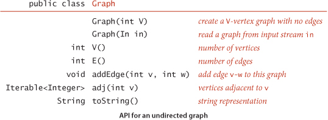
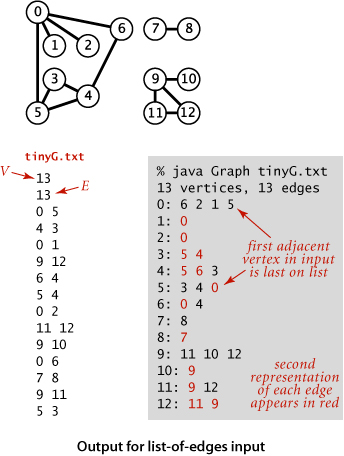
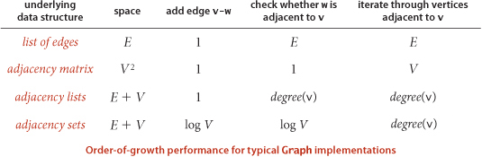
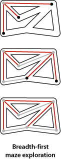

# Chapter 4: Graphs

  - Pairwise connections between items play critical roles in a vast array of computational applications.

    - Is there a way to connect one item to another by following connections?
    - How many items are connected to a given item?
    - What is the shortest chain of connections between this item and another?
  - Graphs are used to answer the questions posed above.  

## 4.1 Undirected Graphs

  - Start of our study. Graph models:

    - edges are nothing more than connections between vertices
  - undirected graphs are used when we need to distinguish this model from other models.
  - Undirected Graph: set of vertices and a collection of edges that connect a pair of vertices
  - By convention, we use the names 0 through V - 1 for the names of vertices in a V-vertex graph
  - we use `v-w` to refer to an edge that connects `v` to `w` 

### Anomalies in Undirected Graphs

  - our definition of a graph allows for two simple anomalies:

    - a self-loop is an edge that connects a vertx to itself
    - two edges that connect the same pair of vertices are parallel
  - graphs with parallel edges are sometimes referred to as *multigraphs* and graphs with no parallel edges
    or self loops are referred to as *simple graphs*
  - We can refer to every edge just by naming the two vertices it connects

### Glossary

  - When there is an edge connecting to vertices, we say that the vertices are adjacent to one another and that the 
    edge is incident to both vertices
  - The degree of a vertex is the number of edges incident to it.
  - A subgraph is a subset of a graphs edges and associated vertices that constitutes a graph.
  - A path in a graph is a sequence of vertices connected by edges.

    -  a simple path is one with no repeated vertices
    - a cycle is a path with at least one edge whose first and last vertices are the same
    - a simple cycle is a cycle with no repeated edges or vertices
    - the length of a path or cycle is its number of edges
  - we say that one vertex is connected to another if there exists a path that contains both of them. 
  - `u-v-w-x` is a path from `u` to `x`
  - `u-v-w-x-u` is a cycle from `u` to `u`
  - a graph is connected if there is a path from every vertex to every other vertex in the graph
  - a graph that is not connected consists of a set of connected components, which are maximal connected subgraphs
  - an acyclic graph is a graph with no cycles
  - a tree is an acyclic connected graph.

    - a disjoint set of trees is called a forest
    - a spanning tree of a connected graph is a subgraph that contains all of the graphs vertices and is a single tree.
    - a spanning forest of a graph is the union of spanning trees and of its connected components
  - A graph `G` with `V` vertices is a tree if and only if it satisfies any of the following five conditions:

    1. G has V-1 edges and no cycles
    2. G has V-1 edges and is connected
    3. G is connected, but removing any edge disconnects it
    4. G is acyclic, but adding any edge creates a cycle
  - density of a graph is the proportion of possible pairs of vertices that are connect by edges.

    - a sparse graph has relatively few of the possible edges present
    - a dense graph has relatively few of the possible edges missing
    - generally we think of a graph as being sparse if its number of different edges is within a small constant factor
      of V and as being dense otherwise
  - a bipartite graph is a graph whose vertices we can divide into two sets such that all edges connect a vertex in one
    set with a vertex in another set

### Undirected Graph Data Type

  

  - this API contains two constructors, methods to return the number of vertices and edges, a method to add to an edge, 
    a `toString()` method, and a method `adj()` that allows client code to iterate through the vertices adjacent to a 
    given vertex. 
  - the second constructor assumes an input format consisting of 2E+2 integer values: V, then E, then E pairs of values
    between 0 and V-1, each pair denoting an edge. 

### Representation Alternatives

  - two basic requirements:

    - we must have the space to accommodate the types of graphs that we are likely to encounter in applications
    - we want to develop time-efficient implementations of `Graph` instance methods - the basic methods that we need
      to develop graph-processing clients
  - 3 possible data structures for implementation:

    1. adjacency matrix: where we maintain a V-by-V boolean array,with the entry row v and column w defined to be `True`
       if there is an edge in the graph that connects vertex v and vertex w in the graph, and `false` otherwise. This
       representation fails on the first count - graphs with millions of vertices are common and the space cost for the 
       V^2 boolean values needed is prohibitive
    2. An Array of Edges: using an Edge class with two instance variables of type `int`.This is simple, but it fails on
       time-efficient count because to implement `adj` we would have to examine all the edges
    3. An Array of Adjacency Lists: we maintain a vertex-indexed array of lists of the vertices adjacent to each vertex.
       
        - so it is a vertex-index array. each index contains a list of vertices considered adjacent to the index vertex
  
### Adjacency-Lists Data Structure

  - standard graph representation for graphs that are not dense is called the adjacency-lists data structure,
    where we keep track of all the vertices adjacent to each vertex on a linked list that is associated with that vertex
  - We maintain an array of lists so that, given a vertex, we can immediately access its list. 
  - We implement these with a Bag ADT with a linked-list implementation, so that we can add new edges in constant
    time and iterate through adjacent vertices in constant time per adjacent vertex.
  - To add an edge connecting `v and w`, we add `w` to `v's` adjacency list and `v` to `w`'s adjacency list. Thus, each
    edge appears twice in the data structure.
  - This implementation achieves the following performance characteristics:

    - Space usage proportional to V + E
    - Constant time to add an edge
    - Time proportional to the degree of V to iterate through vertices adjacent to v

  
  
  
  
### Depth First Search

  - Searching In A Maze

    - searching through a graph can be compared to finding our way through a maze that has passages connected by
      intersections
    - maze = graph, intersection = vertex, passage = edge
    - Tremaux Exploration:

      - take any unmarked passage, unrolling a string behind you
      - mark all intersections and passages the first time you visit them
      - retrace steps (using the string) when approaching a marked section
      - retrace steps when no univisited options remain at an intersection encountered while retracing steps
    - Basic method for searching in a graph mimics the above exploration, but is simpler to describe.
    - Searching in a graph involves invoking a method that visits vertices by:

      - mark it as having been visited
      - visit, recursively, all the vertices that are adjacent to it and that have not yet been marked
    - This is called the *Depth First Search*
    - DFS marks all the vertices connected to a given source in time proportional to the sum of their degrees.
  - One-Way Passages

    - when we have processed all the edges incident to a vertex (explored all the passages leaving an intersection)
      we return. 
    - One way passage mazes are graphs with vertexes that have one entry edge, and one exit edge
    - In a one way maze, we encounter each edge twice and each vertex twice. In a DFS of one way passages, we either
      do a recursive call when we encounter an edge `v-w` (if `w` is not marked), or skip the edge (if `w` is marked)
    - The second time we encounter an edge, in the opposite orientation `w-v`, we always ignore it because the `v` vertex
      has certainly already been visited
  - Tracing DFS

    - one good way to understand an algorithm is to trace its behavior on a small example
    - first thing to bear in mind when doing a trace is that the order in which the edges are examined and vertices 
      visited depends upon the representation, not just the graph or the algorithm
    - Tracing a DFS takes twice as long as the amount of edges
  - Connectivity

    1. Given a graph: are two given vertices connected? How many connected components do they have?
    - this is easily solved with our standard graph-processing design pattern. 
    - First question could be renamed the path detection problem:

      - Given a graph and a source vertex `s`, support queries of the form is there a path from `s` to a given
        target vertex `v`? If so, find it.
      - we do this by putting each vertex encountered on our way to the target vertex in a stack until reaching the target
      - DFS allows us to provide clients with a path from a given source to any marked vertex in time proportional 
        its length.

### Breadth First Search

  - Single-source shortest paths: given a graph and a source vertex `s`, support queries of the form *Is there a path
    from `s` to a given target vertex `v`?* If so, find the shortest path.
  - breadth-first search is the classical method for solving this problem. 
  - To do so, we start at `s` and check for `v` among all the vertices that we can reach by following one edge, then
    we check for `v` among all the vertices we can reach by following two edges, and so on and so forth.

    
  - when we come to a point where we have more than one edge to traverse, we traverse one and save the other for later.